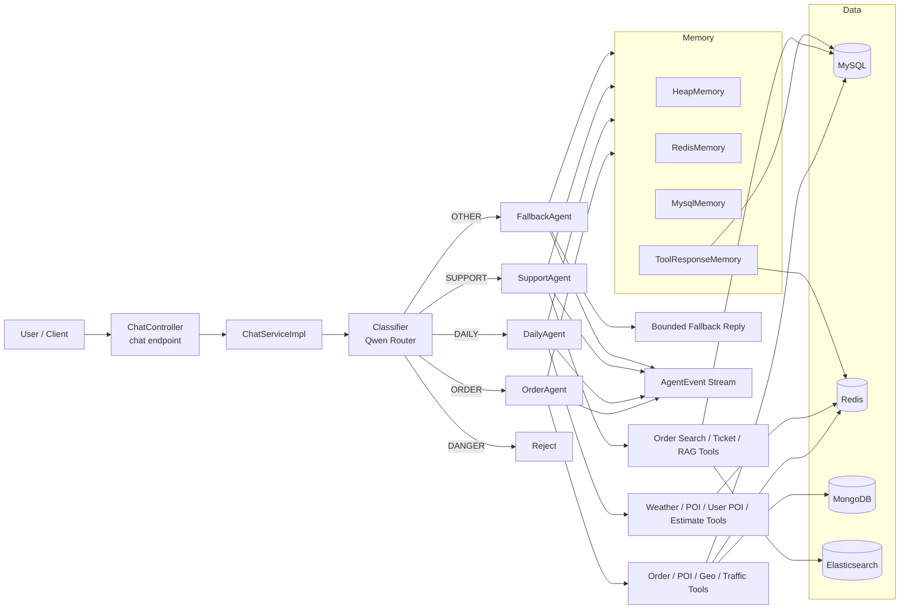
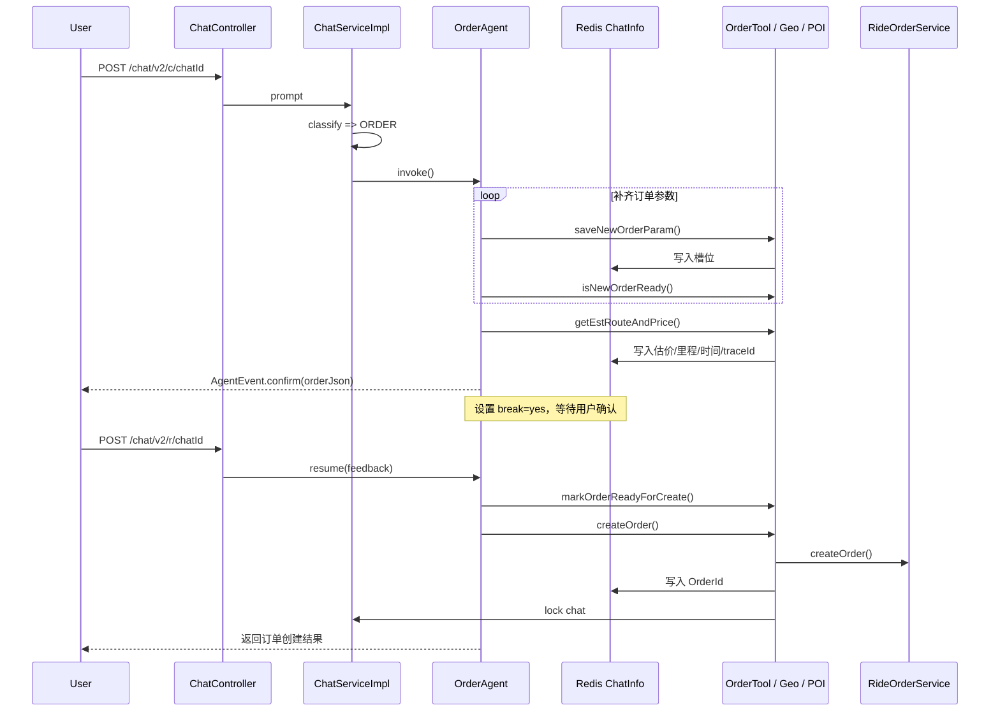

# TaxiAgent

<div align="center">

**一个面向网约车场景的多 Agent Spring Boot 项目**

前置分类路由、领域 Agent 执行、工具调用循环、订单确认断点、多层记忆与多存储协同，全部落在真实代码里。


</div>

## 项目简介

`TaxiAgent` 不是“一个大 Prompt + 一个大模型”式的 Demo，而是把网约车场景拆成了清晰的执行链路：

- 入口层先做意图分类，决定应该交给哪个领域 Agent
- 领域 Agent 再进入工具循环，逐步补齐信息、调用业务能力、生成回复
- 订单链路在创建前强制进入用户确认阶段，避免“模型直接下单”
- 对话与工具结果分别做了分层缓存和持久化，控制上下文长度，同时保留可恢复能力

如果你想看一个 **更偏工程化的 Agent 应用**，这个项目的重点不在“会不会聊天”，而在：

- 怎样把 **路由、记忆、工具调用、业务状态** 串成稳定链路
- 怎样让 Agent 在 **下单、查单、售后、知识库** 之间各司其职
- 怎样把“模型生成”约束进 **可确认、可恢复、可追踪** 的业务流程

## 亮点

- **多 Agent 分工明确**：`OrderAgent`、`DailyAgent`、`SupportAgent`、`FallbackAgent`
- **前置分类路由**：基于用户对话的连续性进行分类，再分发到领域 Agent
- **双模型编排**：当前实现里，路由/分类与领域执行使用不同模型
- **订单 HITL**：下单前触发 `confirm` 事件，用户确认后再 `resume`
- **工具结果指针化**：长工具结果可只保留 `call_id`，需要时再反查
- **多层记忆**：Heap(L1) + Redis(L2) + MySQL(L3)
- **混合检索 RAG**：向量检索 + BM25 + RRF 融合
- **对话锁定机制**：避免跨主题污染，尤其是订单创建后的误续写

## 总体架构



## Agent 链路

### 1. 总路由链路

仓库里的主入口是 [`ChatServiceImpl`](src/main/java/com/fancy/taxiagent/service/impl/ChatServiceImpl.java)：

1. `ChatController` 接收对话请求，返回流式 `Flux<AgentEvent>`
2. `ChatServiceImpl` 根据历史对话和本轮输入做分类
3. 分类结果写入 Redis 的 chat metadata
4. 请求被分发到 4 个专用 Agent 之一
5. Agent 执行工具循环，并把回复、工具状态、确认事件持续推回前端

当前代码中的路由分类标签一共 5 类：

| 标签 | 含义 |
| --- | --- |
| `ORDER` | 新订单创建全流程 |
| `DAILY` | 天气、地点、常用地点、估时估价等日常咨询 |
| `SUPPORT` | 查单、取消、售后、工单、知识库 |
| `OTHER` | 非出行相关内容，交给兜底 Agent |
| `DANGER` | 注入、越权、恶意请求，直接拦截 |

### 2. 四个 Agent 的职责分工

| Agent | 负责什么 | 典型工具 |
| --- | --- | --- |
| `OrderAgent` | 新建订单、补槽位、算价、确认、创建订单 | `saveNewOrderParam`、`isNewOrderReady`、`getEstRouteAndPrice`、`createOrder` |
| `DailyAgent` | 天气、POI 搜索、地址编解码、常用地点管理、简单估时估价 | `CurWeatherTool`、`POISearchTool`、`GeoRegeoTool`、`UserPOITool` |
| `SupportAgent` | 查历史订单、取消订单、改终点、工单流转、规则问答 | `OrderSearchTool`、`TicketTool`、`RagTool` |
| `FallbackAgent` | 非业务域内容兜底，引导用户回到网约车场景 | 纯文本回复，不执行业务工具 |

### 3. OrderAgent 的完整业务链

`OrderAgent` 是这个项目最能体现“Agent 工程化”的部分。它不是简单生成文本，而是在 Redis 里维护订单槽位状态，并强制经过确认断点。



这条链路里有几个关键点：

- **槽位不是只存在 Prompt 里**，而是显式写入 Redis
- **算价与路径规划分离**，起终点未变时可以只重新算价
- **订单创建前必须确认**，由 `confirm` 事件触发前端交互
- **恢复不是补一句话继续聊**，而是通过 `resume()` 把用户确认结果接回工具链
- **订单创建后对话会被锁定**，引导用户开启新会话处理后续需求

### 4. SupportAgent 的知识与售后链

`SupportAgent` 负责把“规则解释”和“动态业务操作”分开处理：

- 静态规则问题：走 `RagTool.searchKnowledgeBase()`
- 动态订单问题：走 `OrderSearchTool`
- 售后跟进：走 `TicketTool`

RAG 部分不是单一路径检索，而是：

1. DashScope Embedding 生成向量
2. Elasticsearch 执行向量检索
3. Elasticsearch 同时执行 BM25 文本检索
4. 后端用 RRF 做结果融合
5. 再按 `groupId` 去重，返回最终知识条目

这让它更像一个可控的客服支持 Agent，而不是只会“猜规则”的聊天机器人。

## 事件流设计

前端接收到的不是单次 JSON，而是一串 `AgentEvent`：

| 事件类型 | 说明 |
| --- | --- |
| `message` | Agent 的文本输出 |
| `tool_start` | 某个工具开始执行 |
| `notify` | 路由提示、状态提示或系统通知 |
| `confirm` | 订单待确认摘要，前端应进入确认交互 |
| `error` | 执行错误 |

这意味着前端可以把它渲染成一种 **“可见工具执行过程 + 最终回复”** 的体验，而不是纯黑盒对话。

## 记忆与数据存储

### 多层记忆

`MessageMemory` 采用分层读取和同步写入：

- `HeapMemory`：当前聚焦对话的热数据
- `RedisMemory`：短中期缓存
- `MysqlMemory`：长期持久化消息

读取顺序是 `Heap -> Redis -> MySQL`，写入则同步落到三层。  
此外，工具结果还会单独进入 `ToolResponseMemory`，避免长结果把上下文撑爆。

### 数据层职责

| 存储 | 用途 |
| --- | --- |
| MySQL | 用户、订单、工单、对话消息、工具调用结果、RAG 映射 |
| Redis | 对话分类、订单槽位、确认断点、缓存消息、工具结果缓存 |
| MongoDB | 订单路径规划轨迹 |
| Elasticsearch | 知识库索引与混合检索 |

## 当前模型编排

从代码实现看，模型编排是分层的：

- **路由默认模型**：`qwen-plus-2025-12-01`
- **分类模型**：`qwen3-max-preview`
- **领域 Agent 执行模型**：`deepseek-chat`
- **Embedding 模型**：`text-embedding-v4`

这种拆分很适合业务 Agent：

- 路由模型专注意图判定
- 领域模型专注工具调用和任务完成
- Embedding 模型专注知识检索

## 技术栈

- Java 21
- Spring Boot 3.5.9
- Spring AI Alibaba Agent Framework 1.1.0.0-RC2
- Spring AI OpenAI Starter 1.1.0-RC1
- MyBatis-Plus 3.5.9
- MySQL
- Redis
- MongoDB
- Elasticsearch
- DashScope
- DeepSeek-compatible OpenAI API

## 目录结构

```text
src/main/java/com/fancy/taxiagent
├─ agents/                 # 4 个领域 Agent
├─ agentbase/tool/         # 工具定义与业务回调
├─ agentbase/memory/       # 多层记忆与工具结果缓存
├─ agentbase/rag/          # 知识库检索与 ES/RRF 融合
├─ agentbase/amap/         # 地图与路线能力
├─ agentbase/qweather/     # 天气能力
├─ controller/             # HTTP 入口
├─ service/                # 业务服务层
├─ mapper/                 # MyBatis-Plus Mapper
├─ domain/                 # DTO / VO / Entity / Enum
└─ config/                 # 配置与系统 Prompt
```

## 快速启动

### 1. 准备基础依赖

你至少需要准备：

- MySQL
- Redis
- MongoDB
- Elasticsearch
- DashScope API Key
- DeepSeek 或兼容 OpenAI API 的 Key
- 高德地图 Key
- 和风天气 Key & Token
- SMTP 邮箱配置

### 2. 初始化数据库

执行：

```bash
src/main/resources/sql/init.sql
src/main/resources/sql/bus_citycode.sql
```

### 3. 填写配置

修改 [`src/main/resources/application.yaml`](src/main/resources/application.yaml) 中的占位值：

```yaml
spring:
  ai:
    dashscope:
      api-key: your-dashscope-api-key
    openai:
      api-key: your-deepseek-api-key
  datasource:
    url: your-database-url
    username: your-database-username
    password: your-database-password
  elasticsearch:
    uris: your-elasticsearch-url
  data:
    redis:
      host: your-redis-host
    mongodb:
      uri: your-mongodb-uri

amap:
  key: your-amap-api-key

qweather:
  key: your-qweather-api-key
  token: your-qweather-api-token
```

### 4. 启动项目

```bash
mvn compile
mvn spring-boot:run
```

## 本地调试方式

主聊天接口位于：

- `POST /chat/v2/c/{id}`：发起对话
- `POST /chat/v2/r/{id}`：恢复订单确认后的会话
- `GET /chat/v2/restore`：检查是否存在可恢复订单会话
- `POST /chat/v2/newuuid`：生成新的 `chatId`

注意：`/chat/v2/**` 接口默认需要登录态与 Token 鉴权。

如果只是本地快速体验 Agent 行为，仓库里还留了一个测试控制器：

- `POST /order/chat/{chatId}`：直接测试 `OrderAgent`
- `POST /order/resume/{chatId}`：测试订单确认恢复
- `POST /order/daily/chat/{chatId}`：直接测试 `DailyAgent`

示例：

```bash
curl -X POST http://localhost:8080/order/chat/demo-order-001 \
  -H "Content-Type: application/json" \
  -d '{"prompt":"帮我从杭州东站打车去西湖，快车，现在出发"}'
```

## 这个项目适合谁看

如果你关心下面这些问题，这个仓库会比普通聊天 Demo 更有参考价值：

- 如何把 Agent 接进真实业务系统，而不是只停留在 prompt playground
- 如何设计一个“先分类、再执行”的多 Agent 架构
- 如何给高风险动作加上确认断点
- 如何把工具调用结果做成可追踪、可回放、可压缩的上下文
- 如何把 RAG、订单系统、工单系统放进同一条 Agent 链路

## 后续可以继续增强的方向

- 增加统一的可观测性：trace、token、tool latency、失败率
- 把路由策略从硬编码 prompt 升级为可评估配置
- 补齐 API 文档与前端事件协议示例
- 增加自动化回归集，覆盖典型订单与售后场景

---

如果你正在做一个垂直业务 Agent，这个项目的重点不是“模型多强”，而是：  
**怎样把模型放进一条能落地、能确认、能恢复、能追踪的业务链路里。**
